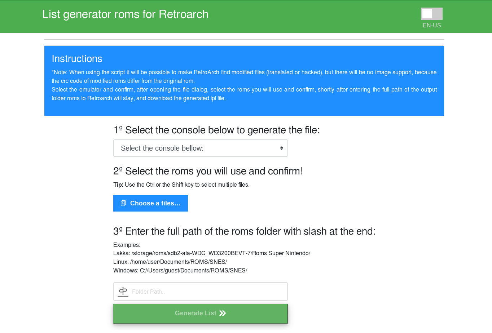

##Retroarch FileScan 2019

Escaneia a pasta de arquivos e gera uma lista em formato json com o nome dos arquivos e outros descritores em formato aceitável para o leitor de playlist do retroarch.

Uso
Selecione o console desejado, selecione as roms, e entre com o caminho real.

Moticação
Na criação desse script o retroarch tinha problemas ao gerar lista automaticas.

Dúvidas tratar com rafahrpl@gmail.com
